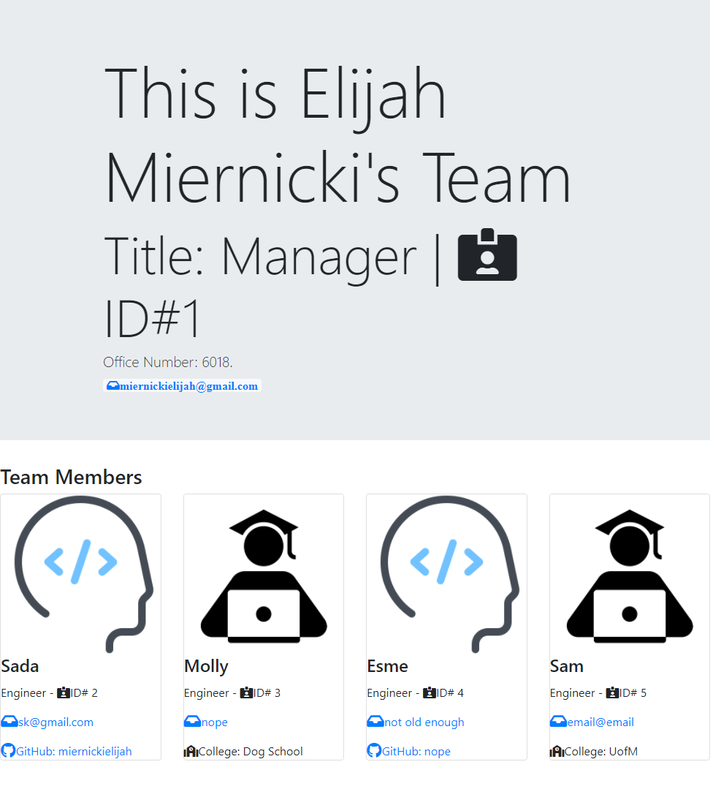

#Warlock
-------------
## Description  
This application allows a manager to dynamically create a webpage through the command line that displays added team members and their basic information (name, role, email, and github link/school). It also allows quick access to these links.
-------------
#Table of Contents  
[Warlock](#Warlock)  
[Description](#Description)  
[Usage](#Usage)  
[Screenshot](#Screenshot)  
[Credits](#Credits)  
[Questions](#Questions)  
[License](#License)  
--------------
## Usage  
In the command line type 'npm i" hit enter, then type node index.js. Afterwards use the command line to follow the prompts to generate an HTML file. 
--------------
## Screenshot  

--------------
## Credits  

--------------
## Questions  
Connect on [github](https://github.com/MiernickiElijah) or email me at miernickielijah@gmail.com with any questions or comments. 
--------------
## License  
This project is covered under the [MIT](https://choosealicense.com/licenses/mit/) license.